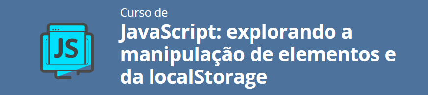
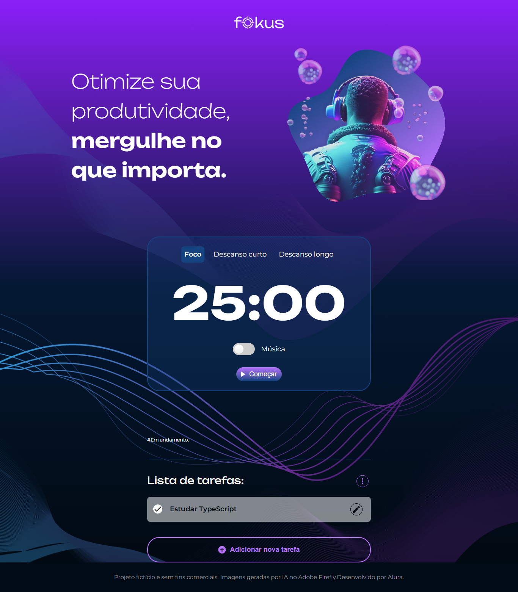

<h1 align="center">✨ JavaScript: explorando a manipulação de elementos e da localStorage</h1>

<section align="center">
    <h2>✨ Linguagens & Tecnologias Usadas para o desenvolvimento desse repositório</h2>
    

        
        
        
        
        
    

</section>

<h1 align="center">📃 Tópicos aprendidos</h1>

- [x] Identifique e utilize seletores CSS para interagir com elementos HTML através do JavaScript
- [x] Aplique conhecimentos de JavaScript para manipular o DOM
- [x] Gerencie eventos do usuário, como cliques ou envios de formulário
- [x] Resolva problemas relacionados à gestão de estado em aplicações web, utilizando armazenamento local e manipulação de array
- [x] Crie interfaces interativas utilizando elementos dinâmicos e eventos para melhorar a experiência do usuário
- [x] Avalie e implemente estratégias eficientes para a persistência de dados no navegador do cliente através do LocalStorage
- [x] Projete uma aplicação web funcional que emprega práticas de armazenamento e recuperação de dados para persistência de estado entre sessões
- [ ] Faz dinheiro

  <h2>💻 Preview プレビュー</h2>
    
   
  

  
<section align="center">
    <h2>Instrutor</h2>
    <table align="center">
        <tr>
            <td>
                
            </td>
        </tr>
        <tr>
            <td>
                <a href="https://www.linkedin.com/in/vinny-neves/">
                    Vinicios Neves
                </a>
            </td>
        </tr>
    </table>
</section>

